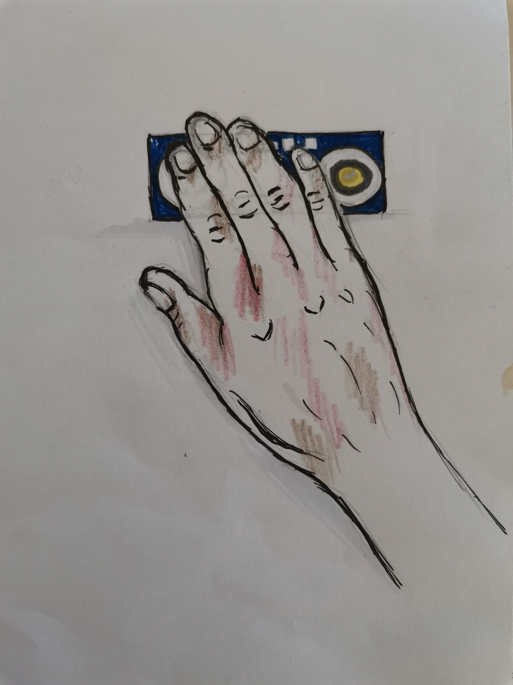

# Lesson: Interaction Design

### First and Last Name: Ελένη Βαβουράκη, Μαρίνα-Ελένη Αναστασιάδου, Παρασκευή Βερνέζου
### University Registration Number: dpsd19009, dpsd19005, dpsd19011
### GitHub Personal Profile: https://github.com/Ebabouraki, https://github.com/Marina-Eleni-Anastasiadou, https://github.com/DPSD19011

# Introduction
Tangible Kids’ toys

# Summary
`Brief:` Στόχος μας είναι ο σχεδιασμός ενός εκπαιδευτικού παιχνιδιού το οποίο θα κάνει πιο ευχάριστη τη διαδικασία πλυσίματος των χεριών για τα παιδιά. Παράλληλα μέσω αυτού θα επιτυγχάνεται η χρονομέτρηση του πλυσίματος των χεριών τους,ώστε να μάθουν τους κανόνες καλής προσωπικής υγιεινής. Η δραστηριότητα θα λαμβάνει μέρος στο οικιακό περιβάλλον(κουζίνα-μπάνιο).Η χρονική διάρκεια θα είναι 1 λεπτό για να κάνουν τις απαραίτητες κινήσεις (άνοιγμα βρύσης- wet, scrub, rinse, dry -κλείσιμο βρύσης), για την αποτελεσματικότερη εξουδετέρωση των μικροβίων.

# 1st Deliverable
Σύντομη περιγραφή σχεδίου 
Έρευνα  PACT
1. Κάναμε ανάλυση ατόμων (χρήστες και άλλα ενδιαφερόμενα μέρη, ορίσαμε ομάδα-στόχο και ποιοι είναι οι χρήστες μας)

Ορίσαμε τις δραστηριότητες (τι κάνουν οι χρήστες πριν από το έργο μας)

Περιγράψαμε το πλαίσιο (Ποιες είναι οι συμφραζόμενες πληροφορίες που έχουμε πριν από την παρέμβαση)

Ελέγξαμε τις απαραίτητες τεχνολογίες (εντοπίσαμε και αναλύσαμε παρόμοια έργα, συλλέξαμε τεχνολογίες που σκοπεύουμε να χρησιμοποιήσουμε: πλατφόρμα/Arduino κ.λπ., αισθητήρες)

**PACT**

PEOPLE

Ομάδες χρηστών: Παιδιά
  
Δημογραφικά στοιχεία:

Φύλο: Αγόρια,Κορίτσια 

Ηλικία: 5-12 ετών

Κατοικία:Ελλάδα

Χαρακτηριστικά:

Ανέμελα

Αυθόρμητα 

Δραστήρια 

Νωθρότητα 

Μη συνειδητοποιημένα

Αρχίζουν οι ευθύνες και οι υποχρεώσεις 
               

**ACTIVITY**

1.What users do before your project

Το πρόβλημα είναι ότι οι χρήστες μας(παιδιά) δεν πλένουν τα χέρια τους σε ένα εύλογο χρονικό διάστημα ώστε να τηρούν τους κανόνες καλής υγιεινής (σαπούνι-άνοιγμα βρύσης-απαραίτητες κινήσεις πλυσίματος χεριών-σκουπισμα χεριών-κλείσιμο βρύσης) και πρόληψης μη μεταφοράς μικροβίων. Αυτό είναι πρόβλημα γιατί, γενικά η καλή υγιεινή των χεριών είναι βασική και απαραίτητη για την αποφυγή μεταφοράς ασθενειών, λοιμώξεων, μικροβίων, σύμφωνα με τους ειδικούς. Ειδικότερα, αυτή τη χρονική περίοδο με την έξαρση του Covid-19  θεωρείται πλέον απαραίτητη η ενημέρωση και τήρηση των κανόνων αυτών, για την μείωση της εξάπλωσης του ιού. 

Επίπεδα διάρκειας(60 sec)

Άνοιγμα βρύσης ---- Σημαντικότητα:Υψηλή Εύρος:1sec

Βρέξιμο χεριών ---- Σημαντικότητα:Χαμηλή Εύρος:5sec

Σαπούνι ---- Σημαντικότητα:Υψηλή Εύρος:3sec

Κινήσεις* ---- Σημαντικότητα:Υψηλή Εύρος:30sec

Ξέπλυμα χεριών ---- Σημαντικότητα:Υψηλή Εύρος:10sec

Σκούπισμα χεριών ---- Σημαντικότητα:Μέτρια Εύρος:10sec

Κλείσιμο βρύσης ---- Σημαντικότητα:Υψηλή Εύρος:1sec

Κινήσεις* ---- Σημαντικότητα:Υψηλή Εύρος:30sec

Τρίψιμό παλαμών ---- 5sec

Τρίψιμό παλάμης με την αντίθετη ραχιαία επιφάνεια του χεριού ---- 5sec

Τρίψιμό επιφανειών ανάμεσα στα δάχτυλα ---- 5sec

Τρίψιμό πίσω μέρος των δαχτύλων ---- 5sec

Τρίψιμό με κυκλικές κινήσεις τους αντίχειρες ---- 5sec

Τρίψιμό το εσωτερικό των παλαμών με τα ακροδάχτυλα ---- 5sec

Τύπος δραστηριότητας: Ατομική

Συχνότητα δραστηριότητας: Καθημερινή

Επικινδυνότητα  δραστηριότητας: Ασφαλής

Πολυπλοκότητα δραστηριότητας: Εύκολη

Περιεχόμενο δραστηριοτητας: 

Απεικόνιση του επιπέδου χρονικής διάρκειας

Απεικονιση των βημάτων της διαδικασίας πλυσιματος των χεριών

Ηχητική υπόκρουση - μελωδία

Led για την ακολουθία για των βημάτων της δραστηριότητας(scrub)

Αισθητήρας υπερύχων(ultrasonic sensor) για την ενεργοποιηση του παιχνιδιού

**CONTEXT**

What are the contextual information we have before the intervention

Το πλύσιμο των χεριών λαμβάνει μέρος στο οικιακό περιβάλλον.Συγκεκριμένα στο μπάνιο και στη κουζίνα
Νεροχύτης Σαπούνι Βρύση Νιπτήρας Πετσέτα Νερό
Αμάθεια Βιασύνη Αδιαφορία Αμέλεια Απάθεια Νωθρότητα

Οργάνωση 

Εκμάθηση των κανόνων προσωπικής υγιεινης ως προς το πλύσιμο των χεριών
Αποτελεσματικότερη διαδικασία για την εξουδετέρωση των μικροβίων
Ενθάρρυνση για τη διεξαγωγή της δραστηριότητας
Πιο ευχάριστη και διασκεδαστική τη διαδικασία
Ελκυστικό προς τα παιδιά

**TECHNOLOGY**

Analyze similar projects

 No-Touch Hand Washing Timer w CPX MakeCode 
 [Resource link](https://youtu.be/M8Fh9-bwPKc)

Input: Χρησιμοποιήστε έναν δυνατό ήχο, όπως ένα παλαμάκι ή ένα χτύπημα για να ενεργοποιήσετε το χρονόμετρο CPX 
Output: Αλληλεπίδραση του συστήματος μέσω φωτεινών ενδείξεων για το επίπεδο διαρκειας του χρόνου
Content: Circuit Playground Express, Αισθητήρα εγγύτητας για την ενεργοποίηση του συστήματος και rgb  led για τη χρονομέτρηση της διαδικασίας
Communication: Οπτική (αλληλεπίδραση με το σύστημα) 
Το σύστημα μέσω του αισθητήρα εγγύτητας αντιλαμβάνεται το κύμα ήχου για την ενεργοποίηση του

CLUE No-Touch Hand Wash Timer w CircuitPython 
[Resource link](https://youtu.be/_Ui1HS6LiPA)

Input: Χρησιμοποιήστε  το κούνημα ενός χεριού για να ξεκινήσετε το CLUE.
Output: Αλληλεπίδραση του συστήματος μέσω οθόνης  για το επίπεδο διαρκειας του χρόνου καθώς και ηχητική ειδοποίηση
Content: Adafruit CLUE - nRF52840 Express, Η έκδοση CLUE αυτού του έργου είναι λίγο πιο εξελιγμένη από την CPX, καθώς έχουμε οθόνη TFT για εργασία και αισθητήρα εγγύτητας για την ενεργοποίηση του συστήματος και για τη χρονομέτρηση της διαδικασίας και ηχείο για τη ηχητική ειδοποίηση.
Communication: Οπτική και ακουστική (αλληλεπίδραση με το σύστημα) και μέσω του αισθητήρα εγγύτητας αντιλαμβάνεται τη συγκεκριμένη κίνηση του χεριού

Timer in use
[Resource link](https://youtu.be/ADCR4gymqrQ)  

Input: Αισθητήρας υπερήχων για την ενεργοποίηση του συστήματος με τη κινηση του χεριού από απόσταση
Output: Αλληλεπίδραση του συστήματος μέσω οθόνης και καταγραφή των δευτερολέπτων (60 δευτερόλεπτα)).
Content:  μια πλακέτα Arduino UNO, ένα μικρό breadboard, μια μονάδα αποφυγής εμποδίων υπερύθρων, μια οθόνη LCD I2C 1602 και ένα μείγμα συρμάτων Dupont 10 cm και 15 cm για τη σύνδεση των εξαρτημάτων
Communication: Οπτική επαφή μέσω του αισθητήρα υπερήχων αντιλαμβάνεται τη συγκεκριμένη κίνηση πέρασμα του χεριού από συγκεκριμένη απόσταση

Collect technologies that you plan to use

**1.Arduino Uno**

Διαστάσεις: 6.9cm x 5.3cm.

Το arduino είναι η καλύτερη επιλογή ως εγκέφαλος για ένα ηλεκτρικό οικιακό προϊόν. Είναι αρκετά φθηνό σχέση με άλλα παρόμοια υποσυστήματα. Το συγκεκριμένο υποσύστημα είναι μικρότερο, καίει λιγότερο ρεύμα και βοηθάει έτσι ώστε η συσκευή να έχει μικρό μέγεθος και μεγαλύτερη διάρκεια μπαταρίας. 

**2. Breadboard**

Διαστάσεις: 5.5 cm x 8.5 cm .

Συνδέει το arduino με τα υπόλοιπα υποσυστήματα.

**3. Ultrasonic sensor**

Διαστάσεις: 3.80 × 7.80 × 15.50 cm.

Χρειάζεται ένας αισθητήρας υπερύχων, ο οποίος συνδέεται με το arduino.Ο σένσορας θα χρεισημοποιείται ως input για την ενεργοποίηση του συστήματος. Απαιτείται το πέρασμα του χεριού  σε απόσταση max 20cm,συγχρόνως θα ξεκινάει τη διαδικασία χρονομέτρησης πλυσίματος χεριών. 

**4.Buzzer/Speaker:**

Διαστάσεις: διάμετρος: 11.78mm & ύψος: 9.16mm.

Το Buzzer χρησιμοποιεται για τη μελωδία, η οποία κάνει πιο εύχαριστη τη διαδικασια για τα παιδιά.

**5.RGB Led**

Διαστάσεις: 4mm x 9mm x 2mm

Χρειάζεται ένα led το οποίο  θα βοηθάει στην οπτική αλληλεπίδραση των παιδιών με το σύστημα κάνοντας πιο ευχάριστη τη διαδικασία αλλάζοντας ομαλά αποχρώσεις χρωμάτων για τα βήματα που πρέπει να ακολουθήσουν.

**6.Καλώδιο παροχής ρευματος**

Το χρειαζόμαστε για τη παροχή ρεύματος του συστήματος. 

**7.Servo Micro Motor**

Διαστάσεις:23mm x 12.5mm x 30mm

Το servo motor έχει τη δυνατότητα να περιστρέφει με μεγάλη ακρίβεια αντικείμενα σε συγκεκριμένες γωνίες. Είναι κατάλληλο για να περιστρέφει εσωτερικά τη κάρτα αναπαράστασης  για την απεικόνιση του χρόνου και των φάσεων για το πλύσιμο χεριών του χρήστη. 

# 2nd Deliverable
### Information Architecture

 ### User interaction
 
Ο χρήστης πηγαίνει στο νιπτήρα για να πλύνει τα χέρια του.Αρχικά ενεργοποιεί το παιχνίδι με το πέρασμα του χεριού του από τον αισθητήρα σε απόσταση max 20 cm για να αρχίσει η διαδικασία.Στη συνέχεια ανοίγει τη βρύση και βρέχει τα χέρια του, παράλληλα βλέπει στο παιχνίδι ενδείξεις για τη ροή του χρόνου καθώς και το βήμα που βρίσκεται μέσω της κάρτας απεικόνισης,παράλληλα ακούει μια μελωδία για να κάνει πιο ευχαριστη τη διαδικασια.Επειτα περναει στη δευτερη φάση στο σαπουνισμα των χεριών κανοντας τις απαραιτητες κινησεις (τρίψιμό παλαμών ,τρίψιμό παλάμης με την αντίθετη ραχιαία επιφάνεια του χεριού ,τρίψιμό επιφανειών ανάμεσα στα δάχτυλα ,τρίψιμό πίσω μέρος των δαχτύλων ,τρίψιμό με κυκλικές κινήσεις τους αντίχειρες ,τρίψιμό το εσωτερικό των παλαμών με τα ακροδάχτυλα).Με ενδείξεις για τη ροή του χρόνου καθώς και το βήμα που βρίσκεται μέσω της κάρτας απεικόνισης,παράλληλα ακούει μια μελωδία για να κάνει πιο ευχαριστη τη διαδικασια και μέσω φωτεινών ενδείξεων για τη κινηση που πρεπει να κανει.Το κάθε χρώμα κρατάει 5 δευτερόλεπτα για τη καθε κίνηση.Ύστερα από την ολοκλήρωση των φάσεων σβήνει η φωτεινή ένδειξη. Μετά την ολοκλήρωση των βημάτων συνεχίζει με το ξέπλυμα των χεριών του και τέλος τα σκουπίζει και ο ρυθμός της μελωδίας αρχίζει σταδιακά να μειώνεται για να σημάνει τη λήξη της διαδικασίας και επειτα κλείνει αυτοματα.

### Interface design

# 3rd Deliverable 

***SCENARIO***

Ο Τόνυ μπαίνοντας στο σπίτι, γυρνώντας από το σχολείο, ακούει τη μητέρα του να του λέει οτι το μεσημεριανό είναι έτοιμο. Έτσι κατευθύνεται προς το μπάνιο για να πλύνει τα χέρια του. Χρησιμοποεί το παιχνίδι που του πήρε η νονά του για να μάθει τη σωστή διαδικασία για το πλύσιμο το χεριών. Πλησιάζοντας τον νιπτήρα πέρναει το χέρι του από το παιχνίδι, σε μια συγκεκριμένη απόσταση για την εκκίνηση της χρονομετρησης. Ξεκιναει ακούγωντας μια μελωδία, ανοίγει τη βρύση, βρεχει τα χέρια του και βάζει σαπούνι και βλεπόντας το φωτακι να ανάβει αρχισει να τρίβει τα χέρια του, αλλάζει κίνηση με τη κάθε εναλλαγή του φωτός.Στη συνέχεια αφου σβήσει το λαμπάκι, ξεπλένει τα χέρια του και τα σκουπιζει μολις το δείξει το σύστημα και αντιλαμβάνει οτι τελειώνει ο χρόνος με τη μείωση του ρυθμού της μελώδίας και τελος κλεινει τη βρύση και παεί να απολαύσει το μεσημεριανό του.

***STORYBOARDS***

 

***PROTOTYPE***

***TINCERCAD***

Ξεκινήσαμε με ψηφιακή μοντελοποίηση μέσω του tincercad όπως μπορείτε να δειτε εδω: [TINCERCAD](https://www.tinkercad.com/things/2q1ZJupAB6x-copy-of-hand-wash-timer/editel)

***CODE***
<pre>
&#47;&#47; C++ code
&#47;&#47; Wash Hands Timer Machine
#include &lt;<b>Servo</b>.h&gt;

int i = 0;

const int RED_PIN = 11;
const int GREEN_PIN = 9;
const int BLUE_PIN = 10;

int DISPLAY_TIME = 100; &nbsp;
const int buzzer = 7; &#47;&#47;buzzer to arduino pin 7
<b>Servo</b> servo_12;

#define NOTE_B0 &nbsp;31
#define NOTE_C1 &nbsp;33
#define NOTE_CS1 35
#define NOTE_D1 &nbsp;37
#define NOTE_DS1 39
#define NOTE_E1 &nbsp;41
#define NOTE_F1 &nbsp;44
#define NOTE_FS1 46
#define NOTE_G1 &nbsp;49
#define NOTE_GS1 52
#define NOTE_A1 &nbsp;55
#define NOTE_AS1 58
#define NOTE_B1 &nbsp;62
#define NOTE_C2 &nbsp;65
#define NOTE_CS2 69
#define NOTE_D2 &nbsp;73
#define NOTE_DS2 78
#define NOTE_E2 &nbsp;82
#define NOTE_F2 &nbsp;87
#define NOTE_FS2 93
#define NOTE_G2 &nbsp;98
#define NOTE_GS2 104
#define NOTE_A2 &nbsp;110
#define NOTE_AS2 117
#define NOTE_B2 &nbsp;123
#define NOTE_C3 &nbsp;131
#define NOTE_CS3 139
#define NOTE_D3 &nbsp;147
#define NOTE_DS3 156
#define NOTE_E3 &nbsp;165
#define NOTE_F3 &nbsp;175
#define NOTE_FS3 185
#define NOTE_G3 &nbsp;196
#define NOTE_GS3 208
#define NOTE_A3 &nbsp;220
#define NOTE_AS3 233
#define NOTE_B3 &nbsp;247
#define NOTE_C4 &nbsp;262
#define NOTE_CS4 277
#define NOTE_D4 &nbsp;294
#define NOTE_DS4 311
#define NOTE_E4 &nbsp;330
#define NOTE_F4 &nbsp;349
#define NOTE_FS4 370
#define NOTE_G4 &nbsp;392
#define NOTE_GS4 415
#define NOTE_A4 &nbsp;440
#define NOTE_AS4 466
#define NOTE_B4 &nbsp;494
#define NOTE_C5 &nbsp;523
#define NOTE_CS5 554
#define NOTE_D5 &nbsp;587
#define NOTE_DS5 622
#define NOTE_E5 &nbsp;659
#define NOTE_F5 &nbsp;698
#define NOTE_FS5 740
#define NOTE_G5 &nbsp;784
#define NOTE_GS5 831
#define NOTE_A5 &nbsp;880
#define NOTE_AS5 932
#define NOTE_B5 &nbsp;988
#define NOTE_C6 &nbsp;1047
#define NOTE_CS6 1109
#define NOTE_D6 &nbsp;1175
#define NOTE_DS6 1245
#define NOTE_E6 &nbsp;1319
#define NOTE_F6 &nbsp;1397
#define NOTE_FS6 1480
#define NOTE_G6 &nbsp;1568
#define NOTE_GS6 1661
#define NOTE_A6 &nbsp;1760
#define NOTE_AS6 1865
#define NOTE_B6 &nbsp;1976
#define NOTE_C7 &nbsp;2093
#define NOTE_CS7 2217
#define NOTE_D7 &nbsp;2349
#define NOTE_DS7 2489
#define NOTE_E7 &nbsp;2637
#define NOTE_F7 &nbsp;2794
#define NOTE_FS7 2960
#define NOTE_G7 &nbsp;3136
#define NOTE_GS7 3322
#define NOTE_A7 &nbsp;3520
#define NOTE_AS7 3729
#define NOTE_B7 &nbsp;3951
#define NOTE_C8 &nbsp;4186
#define NOTE_CS8 4435
#define NOTE_D8 &nbsp;4699
#define NOTE_DS8 4978
#define REST 0

int tempo=92; 

int melody[] = { &nbsp;
 &nbsp;NOTE_E5, 4, &nbsp;NOTE_B4,8, &nbsp;NOTE_C5,8, &nbsp;NOTE_D5,4, &nbsp;NOTE_C5,8, &nbsp;NOTE_B4,8,
 &nbsp;NOTE_A4, 4, &nbsp;NOTE_A4,8, &nbsp;NOTE_C5,8, &nbsp;NOTE_E5,4, &nbsp;NOTE_D5,8, &nbsp;NOTE_C5,8,
 &nbsp;NOTE_B4, -4, &nbsp;NOTE_C5,8, &nbsp;NOTE_D5,4, &nbsp;NOTE_E5,4,
 &nbsp;NOTE_C5, 4, &nbsp;NOTE_A4,4, &nbsp;NOTE_A4,8, &nbsp;NOTE_A4,4, &nbsp;NOTE_B4,8, &nbsp;NOTE_C5,8,

 &nbsp;NOTE_D5, -4, &nbsp;NOTE_F5,8, &nbsp;NOTE_A5,4, &nbsp;NOTE_G5,8, &nbsp;NOTE_F5,8,
 &nbsp;NOTE_E5, -4, &nbsp;NOTE_C5,8, &nbsp;NOTE_E5,4, &nbsp;NOTE_D5,8, &nbsp;NOTE_C5,8,
 &nbsp;NOTE_B4, 4, &nbsp;NOTE_B4,8, &nbsp;NOTE_C5,8, &nbsp;NOTE_D5,4, &nbsp;NOTE_E5,4,
 &nbsp;NOTE_C5, 4, &nbsp;NOTE_A4,4, &nbsp;NOTE_A4,4, REST, 4,

 &nbsp;NOTE_E5, 4, &nbsp;NOTE_B4,8, &nbsp;NOTE_C5,8, &nbsp;NOTE_D5,4, &nbsp;NOTE_C5,8, &nbsp;NOTE_B4,8,
 &nbsp;NOTE_A4, 4, &nbsp;NOTE_A4,8, &nbsp;NOTE_C5,8, &nbsp;NOTE_E5,4, &nbsp;NOTE_D5,8, &nbsp;NOTE_C5,8,
 &nbsp;NOTE_B4, -4, &nbsp;NOTE_C5,8, &nbsp;NOTE_D5,4, &nbsp;NOTE_E5,4,
 &nbsp;NOTE_C5, 4, &nbsp;NOTE_A4,4, &nbsp;NOTE_A4,8, &nbsp;NOTE_A4,4, &nbsp;NOTE_B4,8, &nbsp;NOTE_C5,8,

 &nbsp;NOTE_D5, -4, &nbsp;NOTE_F5,8, &nbsp;NOTE_A5,4, &nbsp;NOTE_G5,8, &nbsp;NOTE_F5,8,
 &nbsp;NOTE_E5, -4, &nbsp;NOTE_C5,8, &nbsp;NOTE_E5,4, &nbsp;NOTE_D5,8, &nbsp;NOTE_C5,8,
 &nbsp;NOTE_B4, 4, &nbsp;NOTE_B4,8, &nbsp;NOTE_C5,8, &nbsp;NOTE_D5,4, &nbsp;NOTE_E5,4,
 &nbsp;NOTE_C5, 4, &nbsp;NOTE_A4,4, &nbsp;NOTE_A4,4, REST, 4,
 &nbsp;

 &nbsp;NOTE_E5,2, &nbsp;NOTE_C5,2,
 &nbsp;NOTE_D5,2, &nbsp;&nbsp;NOTE_B4,2,
 &nbsp;NOTE_C5,2, &nbsp;&nbsp;NOTE_A4,2,
 &nbsp;NOTE_GS4,2, &nbsp;NOTE_B4,4, &nbsp;REST,8, 
 &nbsp;NOTE_E5,2, &nbsp;&nbsp;NOTE_C5,2,
 &nbsp;NOTE_D5,2, &nbsp;&nbsp;NOTE_B4,2,
 &nbsp;NOTE_C5,4, &nbsp;&nbsp;NOTE_E5,4, &nbsp;NOTE_A5,2,
 &nbsp;NOTE_GS5,2,

};
int notes=sizeof(melody)&#47;sizeof(melody[0])&#47;2; 
int wholenote = (60000 * 4) &#47; tempo;
int divider = 0, noteDuration = 0;
long readUltrasonicDistance(int triggerPin, int echoPin)
{
 &nbsp;pinMode(triggerPin, OUTPUT); &nbsp;&#47;&#47; Clear the trigger
 &nbsp;digitalWrite(triggerPin, LOW);
 &nbsp;delayMicroseconds(2);
 &nbsp;&#47;&#47; Sets the trigger pin to HIGH state for 10 microseconds
 &nbsp;digitalWrite(triggerPin, HIGH);
 &nbsp;delayMicroseconds(10);
 &nbsp;digitalWrite(triggerPin, LOW);
 &nbsp;pinMode(echoPin, INPUT);
 &nbsp;&#47;&#47; Reads the echo pin, and returns the sound wave travel time in microseconds
 &nbsp;return pulseIn(echoPin, HIGH);
}

void setup()
{
 &nbsp;servo_12.attach(12, 500, 2500);
 &nbsp;&nbsp;&nbsp;&#47;&#47; pinMode(7, OUTPUT);
 &nbsp;&nbsp;&nbsp;pinMode(buzzer, OUTPUT);
 &nbsp;pinMode(RED_PIN, OUTPUT);
 &nbsp;pinMode(GREEN_PIN, OUTPUT);
 &nbsp;pinMode(BLUE_PIN, OUTPUT);&#47;&#47; Set buzzer - pin 7 as an output
 &nbsp;&nbsp;&nbsp;<b>Serial</b>.begin(115200);
}

void loop()
{
 &nbsp;servo_12.write(0);
 &nbsp;if &nbsp;(0.01723 * readUltrasonicDistance(2,3)&lt; 20) {

 &nbsp;&nbsp;&nbsp;&nbsp;&nbsp;
 &nbsp;
 &nbsp;&nbsp;&nbsp;for (i = 1; i &lt; 180; i += 1) {
 &nbsp;&nbsp;&nbsp;&nbsp;&nbsp;if( i == 30 )
 &nbsp;&nbsp;&nbsp;&nbsp;&nbsp;{
 &nbsp;&nbsp;&nbsp;&nbsp;&nbsp;&nbsp;&nbsp;digitalWrite(RED_PIN, HIGH);
 &nbsp;digitalWrite(GREEN_PIN, LOW);
 &nbsp;digitalWrite(BLUE_PIN, LOW);

 
 &nbsp;&nbsp;&nbsp;&nbsp;&nbsp;}
 &nbsp;&nbsp;&nbsp;&nbsp;&nbsp;&nbsp;if( i == 45 )
 &nbsp;&nbsp;&nbsp;&nbsp;&nbsp;{
 &nbsp;&nbsp;&nbsp;&nbsp;&nbsp;&nbsp;&nbsp;&nbsp;&nbsp;&nbsp;digitalWrite(RED_PIN, LOW);
 &nbsp;digitalWrite(GREEN_PIN, LOW);
 &nbsp;digitalWrite(BLUE_PIN, HIGH);
 &nbsp;&nbsp;

 &nbsp;&nbsp;&nbsp;&nbsp;&nbsp;}
 &nbsp;&nbsp;&nbsp;&nbsp;&nbsp;&nbsp;&nbsp;&nbsp;&nbsp;if( i == 60 )
 &nbsp;&nbsp;&nbsp;&nbsp;&nbsp;{
 &nbsp;digitalWrite(RED_PIN, LOW);
 &nbsp;digitalWrite(GREEN_PIN, HIGH);
 &nbsp;digitalWrite(BLUE_PIN, LOW);

 &nbsp;&nbsp;&nbsp;&nbsp;&nbsp;}
 &nbsp;&nbsp;&nbsp;&nbsp;&nbsp;&nbsp;&nbsp;&nbsp;&nbsp;&nbsp;&nbsp;if( i == 75 )
 &nbsp;&nbsp;&nbsp;&nbsp;&nbsp;{
 &nbsp;&nbsp;digitalWrite(RED_PIN, HIGH);
 &nbsp;digitalWrite(GREEN_PIN, LOW);
 &nbsp;digitalWrite(BLUE_PIN, HIGH);

 &nbsp;&nbsp;&nbsp;&nbsp;&nbsp;}
 &nbsp;&nbsp;&nbsp;&nbsp;&nbsp;&nbsp;&nbsp;&nbsp;&nbsp;&nbsp;&nbsp;&nbsp;&nbsp;&nbsp;if( i == 90 )
 &nbsp;&nbsp;&nbsp;&nbsp;&nbsp;{
 &nbsp;&nbsp;digitalWrite(RED_PIN, LOW);
 &nbsp;digitalWrite(GREEN_PIN, HIGH);
 &nbsp;digitalWrite(BLUE_PIN, HIGH);

 &nbsp;&nbsp;&nbsp;&nbsp;&nbsp;}
 &nbsp;&nbsp;&nbsp;&nbsp;&nbsp;&nbsp;if( i == 105 )
 &nbsp;&nbsp;&nbsp;&nbsp;&nbsp;{
 &nbsp;&nbsp;digitalWrite(RED_PIN, LOW);
 &nbsp;digitalWrite(GREEN_PIN, LOW);
 &nbsp;digitalWrite(BLUE_PIN, LOW);

 &nbsp;&nbsp;&nbsp;&nbsp;&nbsp;}
 
 &nbsp;&nbsp;&nbsp;&nbsp;&nbsp;servo_12.write(i);
 &nbsp;&nbsp;&nbsp;&nbsp;&nbsp;delay(45); &#47;&#47; Wait for 335 millisecond(s)
&#47;&#47; calculates the duration of each note
 &nbsp;&nbsp;&nbsp;&nbsp;&nbsp;&nbsp;&nbsp;&nbsp;&nbsp;&nbsp;&nbsp;&nbsp;
 &nbsp;&nbsp;&nbsp;divider = melody[i + 1];
 &nbsp;&nbsp;&nbsp;if (divider &gt; 0) {
 &nbsp;&nbsp;&nbsp;&nbsp;&nbsp;&#47;&#47; regular note, just proceed
 &nbsp;&nbsp;&nbsp;&nbsp;&nbsp;noteDuration = (wholenote) &#47; divider;
 &nbsp;&nbsp;&nbsp;} else if (divider &lt; 0) {
 &nbsp;&nbsp;&nbsp;&nbsp;&nbsp;&#47;&#47; dotted notes are represented with negative durations!!
 &nbsp;&nbsp;&nbsp;&nbsp;&nbsp;noteDuration = (wholenote) &#47; abs(divider);
 &nbsp;&nbsp;&nbsp;&nbsp;&nbsp;noteDuration *= 1.5; &#47;&#47; increases the duration in half for dotted notes
 &nbsp;&nbsp;&nbsp;}
 &nbsp;&nbsp;&nbsp;&#47;&#47; we only play the note for 90% of the duration, leaving 10% as a pause
 &nbsp;&nbsp;&nbsp;tone(buzzer, melody[i], noteDuration*0.9);

 &nbsp;&nbsp;&nbsp;&#47;&#47; Wait for the specief duration before playing the next note.
 &nbsp;&nbsp;&nbsp;delay(noteDuration);
 &nbsp;&nbsp;&nbsp;
 &nbsp;&nbsp;&nbsp;&#47;&#47; stop the waveform generation before the next note.
 &nbsp;&nbsp;&nbsp;noTone(buzzer);
 &nbsp;&nbsp;&nbsp;&nbsp;&nbsp;
 &nbsp;&nbsp;&nbsp;&nbsp;&nbsp;&nbsp;&nbsp;&nbsp;&nbsp;&nbsp;&nbsp;
 &nbsp;&nbsp;&nbsp;}
 &nbsp;&nbsp;&nbsp;
 &nbsp;} else {
 &nbsp;&nbsp;&nbsp;servo_12.write(0);
 &nbsp;&nbsp;&nbsp;&nbsp;&nbsp;&nbsp;
 &nbsp;}
 &nbsp;&nbsp;&nbsp;<b>Serial</b>.print(&#34;Distance : &#34;);
 &nbsp;&nbsp;&nbsp;<b>Serial</b>.print(0.01723 * readUltrasonicDistance(3, 3));
 &nbsp;&nbsp;&nbsp;<b>Serial</b>.println();

}

</pre>

# Conclusions

# Sources
