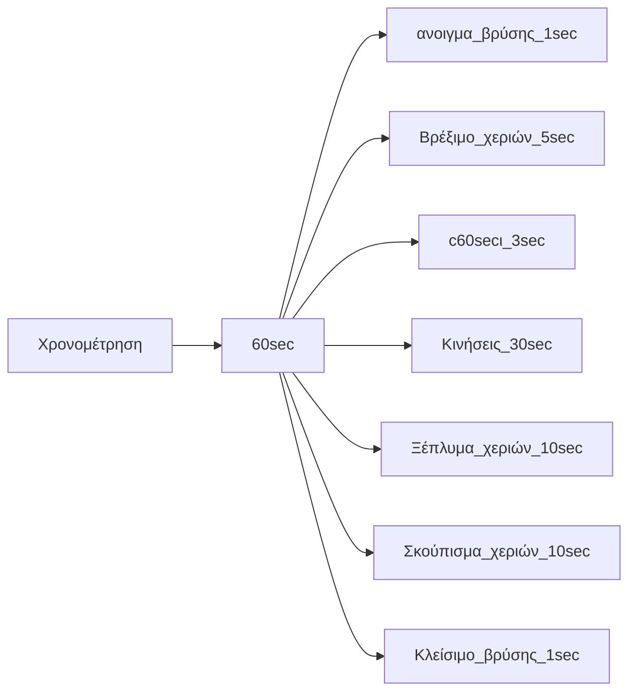
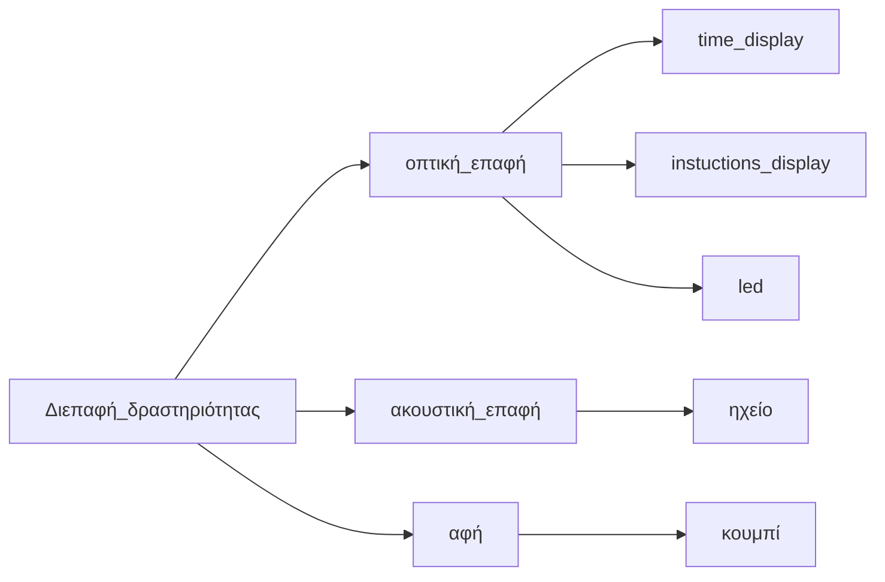

# Lesson: Interaction Design

### First and Last Name: Ελένη Βαβουράκη, Μαρίνα-Ελένη Αναστασιάδου, Παρασκευή Βερνέζου
### University Registration Number: dpsd19009, dpsd19005, dpsd19011
### GitHub Personal Profile: https://github.com/Ebabouraki, https://github.com/Marina-Eleni-Anastasiadou, https://github.com/DPSD19011

# Introduction
Tangible Kids’ toys

# Summary
Brief: Στόχος μας είναι ο σχεδιασμός ενός εκπαιδευτικού παιχνιδιού το οποίο θα κάνει πιο ευχάριστη τη διαδικασία πλυσίματος των χεριών για τα παιδιά. Παράλληλα μέσω αυτού θα επιτυγχάνεται η χρονομέτρηση του πλυσίματος των χεριών τους,ώστε να μάθουν τους κανόνες καλής προσωπικής υγιεινής. Η δραστηριότητα θα λαμβάνει μέρος στο οικιακό περιβάλλον(κουζίνα-μπάνιο).Η χρονική διάρκεια θα είναι 1 λεπτό για να κάνουν τις απαραίτητες κινήσεις (άνοιγμα βρύσης- wet, scrub, rinse, dry -κλείσιμο βρύσης), για την αποτελεσματικότερη εξουδετέρωση των μικροβίων.


# 1st Deliverable
Σύντομη περιγραφή σχεδίου 
Έρευνα  PACT
1. Κάναμε ανάλυση ατόμων (χρήστες και άλλα ενδιαφερόμενα μέρη, ορίσαμε ομάδα-στόχο και ποιοι είναι οι χρήστες μας)

Ορίσαμε τις δραστηριότητες (τι κάνουν οι χρήστες πριν από το έργο μας)

Περιγράψαμε το πλαίσιο (Ποιες είναι οι συμφραζόμενες πληροφορίες που έχουμε πριν από την παρέμβαση)

Ελέγξαμε τις απαραίτητες τεχνολογίες (εντοπίσαμε και αναλύσαμε παρόμοια έργα, συλλέξαμε τεχνολογίες που σκοπεύουμε να χρησιμοποιήσουμε: πλατφόρμα/Arduino κ.λπ., αισθητήρες)

PACT

PEOPLE
Ομάδες χρηστών
  Παιδιά
  
Δημογραφικά στοιχεία

Φύλο: Αγόρια,Κορίτσια 

Ηλικία: 5-12 ετών

Κατοικία:Ελλάδα

Χαρακτηριστικά:

Ανέμελα

Αυθόρμητα 

Δραστήρια 

Νωθρότητα 

Μη συνειδητοποιημένα

Αρχίζουν οι ευθύνες και οι υποχρεώσεις 
               


ACTIVITY

1.What users do before your project

Το πρόβλημα είναι ότι οι χρήστες μας(παιδιά) δεν πλένουν τα χέρια τους σε ένα εύλογο χρονικό διάστημα ώστε να τηρούν τους κανόνες καλής υγιεινής (σαπούνι-άνοιγμα βρύσης-απαραίτητες κινήσεις πλυσίματος χεριών-σκουπισμα χεριών-κλείσιμο βρύσης) και πρόληψης μη μεταφοράς μικροβίων. Αυτό είναι πρόβλημα γιατί, γενικά η καλή υγιεινή των χεριών είναι βασική και απαραίτητη για την αποφυγή μεταφοράς ασθενειών, λοιμώξεων, μικροβίων, σύμφωνα με τους ειδικούς. Ειδικότερα, αυτή τη χρονική περίοδο με την έξαρση του Covid-19  θεωρείται πλέον απαραίτητη η ενημέρωση και τήρηση των κανόνων αυτών, για την μείωση της εξάπλωσης του ιού. 


Επίπεδα διάρκειας(60 sec)

Άνοιγμα βρύσης ---- Σημαντικότητα:Υψηλή Εύρος:1sec

Βρέξιμο χεριών ---- Σημαντικότητα:Χαμηλή Εύρος:5sec

Σαπούνι ---- Σημαντικότητα:Υψηλή Εύρος:3sec

Κινήσεις* ---- Σημαντικότητα:Υψηλή Εύρος:30sec

Ξέπλυμα χεριών ---- Σημαντικότητα:Υψηλή Εύρος:10sec

Σκούπισμα χεριών ---- Σημαντικότητα:Μέτρια Εύρος:10sec

Κλείσιμο βρύσης ---- Σημαντικότητα:Υψηλή Εύρος:1sec


Κινήσεις* ---- Σημαντικότητα:Υψηλή Εύρος:30sec

Τρίψιμό παλαμών ---- 5sec

Τρίψιμό παλάμης με την αντίθετη ραχιαία επιφάνεια του χεριού ---- 5sec

Τρίψιμό επιφανειών ανάμεσα στα δάχτυλα ---- 5sec

Τρίψιμό πίσω μέρος των δαχτύλων ---- 5sec

Τρίψιμό με κυκλικές κινήσεις τους αντίχειρες ---- 5sec

Τρίψιμό το εσωτερικό των παλαμών με τα ακροδάχτυλα ---- 5sec


Τύπος δραστηριότητας: Ατομική

Συχνότητα δραστηριότητας: Καθημερινή

Επικινδυνότητα  δραστηριότητας: Ασφαλής

Πολυπλοκότητα δραστηριότητας: Εύκολη

Περιεχόμενο δραστηριοτητας: 

Απεικόνιση του επιπέδου χρονικής διάρκειας

Απεικονιση των βημάτων της διαδικασίας πλυσιματος των χεριών

Ηχητική υπόκρουση

Led για την ακολουθία για των βημάτων της δραστηριότητας

Led για την μπαταρία 

Κουμπί για την ενεργοποιηση του παιχνιδιού


CONTEXT

What are the contextual information we have before the intervention

Το πλύσιμο των χεριών λαμβάνει μέρος στο οικιακό περιβάλλον.Συγκεκριμένα στο μπάνιο και στη κουζίνα
Νεροχύτης Σαπούνι Βρύση Νιπτήρας Πετσέτα Νερό
Αμάθεια Βιασύνη Αδιαφορία Αμέλεια Απάθεια Νωθρότητα

Οργάνωση 

Εκμάθηση των κανόνων προσωπικής υγιεινης ως προς το πλύσιμο των χεριών
Αποτελεσματικότερη διαδικασία για την εξουδετέρωση των μικροβίων
Ενθάρρυνση για τη διεξαγωγή της δραστηριότητας
Πιο ευχάριστη και διασκεδαστική τη διαδικασία
Ελκυστικό προς τα παιδιά


TECHNOLOGY

Analyze similar projects

 No-Touch Hand Washing Timer w CPX MakeCode https://youtu.be/M8Fh9-bwPKc 

Input: Χρησιμοποιήστε έναν δυνατό ήχο, όπως ένα παλαμάκι ή ένα χτύπημα για να ενεργοποιήσετε το χρονόμετρο CPX 
Output: Αλληλεπίδραση του συστήματος μέσω φωτεινών ενδείξεων για το επίπεδο διαρκειας του χρόνου
Content: Circuit Playground Express, Αισθητήρα εγγύτητας για την ενεργοποίηση του συστήματος και rgb  led για τη χρονομέτρηση της διαδικασίας
Communication: Οπτική (αλληλεπίδραση με το σύστημα) 
Το σύστημα μέσω του αισθητήρα εγγύτητας αντιλαμβάνεται το κύμα ήχου για την ενεργοποίηση του

CLUE No-Touch Hand Wash Timer w CircuitPython https://youtu.be/_Ui1HS6LiPA 

Input: Χρησιμοποιήστε  το κούνημα ενός χεριού για να ξεκινήσετε το CLUE.
Output: Αλληλεπίδραση του συστήματος μέσω οθόνης  για το επίπεδο διαρκειας του χρόνου καθώς και ηχητική ειδοποίηση
Content: Adafruit CLUE - nRF52840 Express, Η έκδοση CLUE αυτού του έργου είναι λίγο πιο εξελιγμένη από την CPX, καθώς έχουμε οθόνη TFT για εργασία και αισθητήρα εγγύτητας για την ενεργοποίηση του συστήματος και για τη χρονομέτρηση της διαδικασίας και ηχείο για τη ηχητική ειδοποίηση.
Communication: Οπτική και ακουστική (αλληλεπίδραση με το σύστημα) και μέσω του αισθητήρα εγγύτητας αντιλαμβάνεται τη συγκεκριμένη κίνηση του χεριού

Timer in use https://youtu.be/ADCR4gymqrQ 

Input: Αισθητήρας υπερήχων για την ενεργοποίηση του συστήματος με τη κινηση του χεριού από απόσταση
Output: Αλληλεπίδραση του συστήματος μέσω οθόνης και καταγραφή των δευτερολέπτων (60 δευτερόλεπτα)).
Content:  μια πλακέτα Arduino UNO, ένα μικρό breadboard, μια μονάδα αποφυγής εμποδίων υπερύθρων, μια οθόνη LCD I2C 1602 και ένα μείγμα συρμάτων Dupont 10 cm και 15 cm για τη σύνδεση των εξαρτημάτων
Communication: Οπτική επαφή μέσω του αισθητήρα υπερήχων αντιλαμβάνεται τη συγκεκριμένη κίνηση πέρασμα του χεριού από συγκεκριμένη απόσταση

Collect technologies that you plan to use

1.Arduino Nano
Διαστάσεις: 45mm x 18mm .
Το arduino είναι η καλύτερη επιλογή ως εγκέφαλος για ένα ηλεκτρικό οικιακό προϊόν. Είναι αρκετά φθηνό σχέση με άλλα παρόμοια υποσυστήματα. Το συγκεκριμένο υποσύστημα είναι μικρότερο, καίει λιγότερο ρεύμα και βοηθάει έτσι ώστε η συσκευή να έχει μικρό μέγεθος και μεγαλύτερη διάρκεια μπαταρίας. 

2. Διάτρητη πλακέτα PCB
Διαστάσεις: 40mm x 60mm x 1,6mm .
Συνδέει το arduino με τα υπόλοιπα υποσυστήματα ( στη πλακέτα συγκολλούνται τα εξαρτηματα).

3. Button
Διαστάσεις: 12mm x 12mm x 6mm.
Χρειάζονται 2 pushbuttons που να συνδέονται με το arduino.Τα κουμπιά θα ενεργοποιούν το σύστημα και συγχρόνως θα ξεκινάει τη διαδικασία χρονομέτρησης. Το ένα θα δίνει στο χρήστη την επιλογή να πλύνει τα χέρια του 1 λεπτό και το άλλο για 2 λεπτά.

4.Buzzer/Speaker:
Διαστάσεις: διάμετρος: 11.78mm & ύψος: 9.16mm.
Το ηχείο χρειάζεται για να ενημερώνει το χρήστη για την εναλλαγή φάσης της διαδικασίας καθώς και για τη λήξη της.

5.Led Ταινία
Τα led θα αλλάζουν 3 χρώματα(πράσινο πορτοκαλί και  κόκκινο) και θα  δείχνει τη κατάσταση της μπαταρίας του συστήματος(υψηλή,μετρια,χαμηλή).  

6.RGB Led
Διαστάσεις: 4mm x 9mm x 2mm
Χρειάζεται ένα led το οποίο  θα βοηθάει στην οπτική αλληλεπίδραση των παιδιών με το σύστημα κάνοντας πιο ευχάριστη τη διαδικασία αλλάζοντας ομαλά αποχρώσεις χρωμάτων για τα βήματα που πρέπει να ακολουθήσουν.

7. PowerBoost 500 Charger
Διαστάσεις:22mm x 37mm x 2mm
Το PowerBoost 500C το χρειαζόμαστε για τροφοδοτικό. Με ένα ενσωματωμένο κύκλωμα φορτιστή μπαταρίας, για να το φορτίζει ο χρήστης όταν έχει τελειώσει η μπαταρία πριν την επομένη χρήση καθώς θα μπορεί να το χρησιμοποιήσει ακόμη και κατά τη φόρτιση της μπαταρίας. Το υποσύστημα μπορεί να τροφοδοτείται από οποιαδήποτε μπαταρία LiIon / LiPoly 3.7V και να μετατρέπει την έξοδο της μπαταρίας σε 5.2V DC για την εκτέλεση των έργων 5V.

8.Servo Micro Motor
Διαστάσεις:23mm x 12.5mm x 30mm
Το servo motor έχει τη δυνατότητα να περιστρέφει με μεγάλη ακρίβεια αντικείμενα σε συγκεκριμένες γωνίες. Είναι κατάλληλο για να περιστρέφει εσωτερικά τη κάρτα αναπαράστασης  για την απεικόνιση του χρόνου και των φάσεων για το πλύσιμο χεριών του χρήστη. 


# 2nd Deliverable
### Information Architecture


graph LR
A(Χρονομέτρηση) --> B[60 sec]
B( 60 sec) --> C[ανοιγμα βρύσης]
C(ανοιγμα βρύσης)--> M[1 sec]
B( 60 sec) --> D[Βρέξιμο_χεριών]
 D(Βρέξιμο_χεριών)--> N[5 sec]
B( 60 sec) --> G[Σαπούνι]
G(Σαπούνι)  --> Ο[3 sec]
B( 60 sec) --> H[Κινήσεις]
 H[Κινήσεις] --> Q[30 sec]
B( 60 sec) --> I[Ξέπλυμα χεριών]
I(Ξέπλυμα χεριών) --> R[10 sec]
B( 60 sec) --> K[Σκούπισμα χεριών]
I(Σκούπισμα χεριών) --> R[10 sec]
B( 60 sec) --> L[Κλείσιμο βρύσης]
L(Κλείσιμο βρύσης) --> M[1 sec]
```


 ### User interaction
Ο χρήστης πηγαίνει στο νιπτήρα για να πλύνει τα χέρια του.Αρχικά ενεργοποιεί το παιχνίδι με το πάτημα ενός κουμπιού για να αρχίσει η διαδικασία.Στη συνέχεια ανοίγει τη βρύση και βρέχει τα χέρια του, παράλληλα βλέπει στο παιχνίδι ενδείξεις για τη ροή του χρόνου καθώς και τα βήματα  μέσω φωτεινών ενδείξεων, ηχητικής ειδοποίησης και της απεικόνισης τους έτσι ώστε να μάθει τη σωστή διαδικασία πλυσίματος των χεριών.Καθώς προχωράει η διαδικασία ο χρήστης ειδοποιείται ότι πρέπει να περάσει στην επόμενη φάση και να σαπουνίσει τα χέρια του κανοντας τις απαραιτητες κινησεις (τρίψιμό παλαμών ,τρίψιμό παλάμης με την αντίθετη ραχιαία επιφάνεια του χεριού ,τρίψιμό επιφανειών ανάμεσα στα δάχτυλα ,τρίψιμό πίσω μέρος των δαχτύλων ,τρίψιμό με κυκλικές κινήσεις τους αντίχειρες ,τρίψιμό το εσωτερικό των παλαμών με τα ακροδάχτυλα) Μετά την ολοκλήρωση των βημάτων συνεχίζει με το ξέπλυμα των χεριών του και τέλος τα σκουπίζει και το σύστημα σημάνει τη λήξη του χρόνου με ηχητική ειδοποίηση και επειτα κλείνει αυτοματα.

### Interface design


# 3rd Deliverable 


# Conclusions


# Sources
